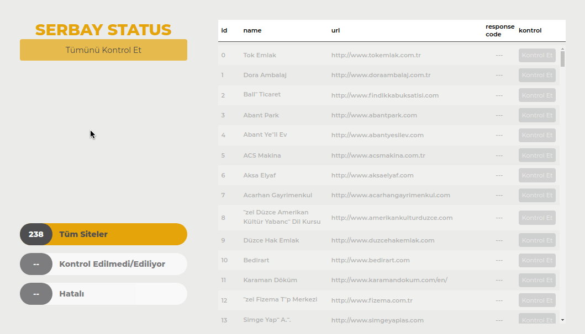

# Serbay Status
Serbay Interactive'in yaptığı siteleri kontrol edip HTTP cevap kodlarını gösterir.
(express tools server içerisinde)

## Tools used
- Node.js
- Socket.io
- express
- node-fetch
- serve-index

## Usage
- Clone repo
- `npm install`
- `npm start`
- Served in `localhost:3000/status/serbay`

## Demo

